**TODOS**
* prevest na engleski
* dodat instrukcije za linux, mac
* dodat detaljne instrukcije za slike ispod (klik vamo tamo)

Kada klonirate projekat ili skinete sa našeg GitHub Repository pokrenite u Visual Studio programu
Takodjer instalirajte MySQL.data paket unutar projekta

DEPENDENCIES

.NET 9.0

MySQL 8.0.41.0
https://dev.mysql.com/get/Downloads/MySQLInstaller/mysql-installer-community-8.0.41.0.msi

Unutar MySQL INSTALLERA imate opciju da dodate MySQL Server unutar instalera

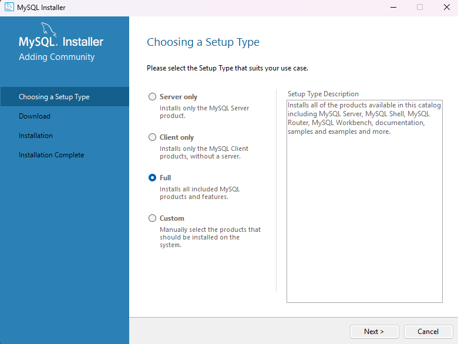

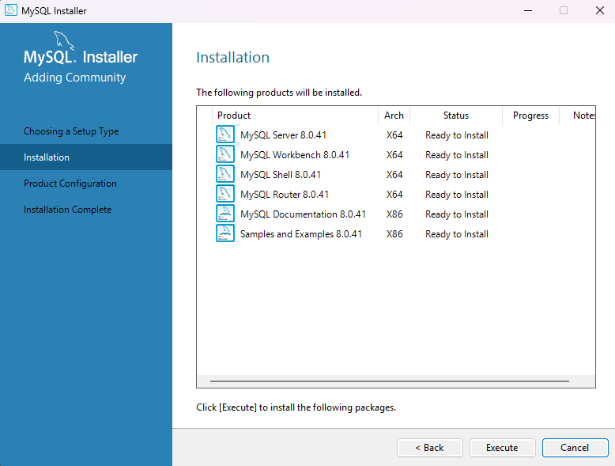

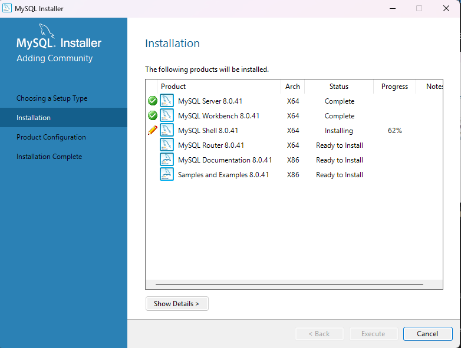

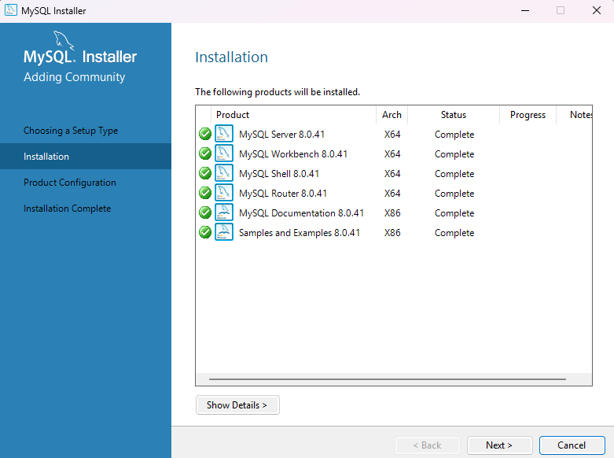

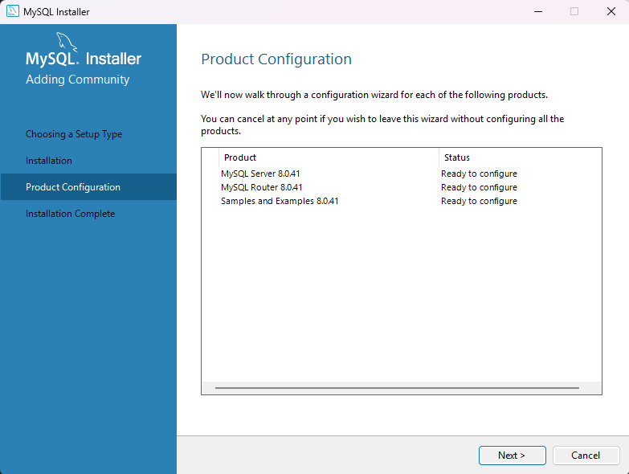

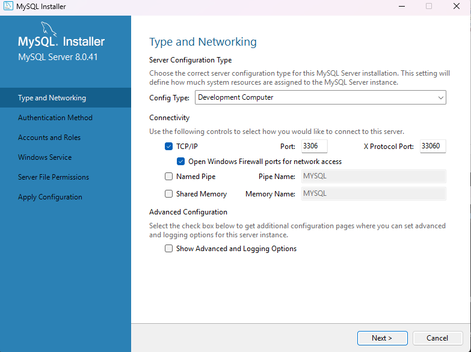

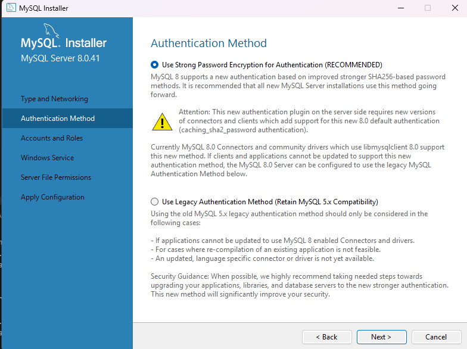

kao password stavite 'root'

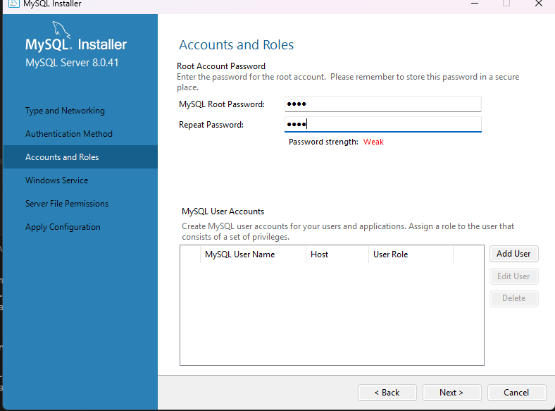

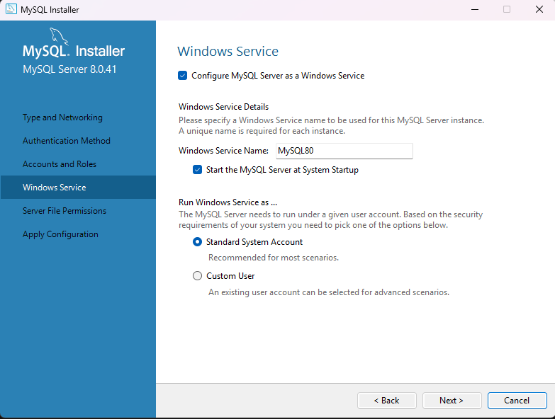

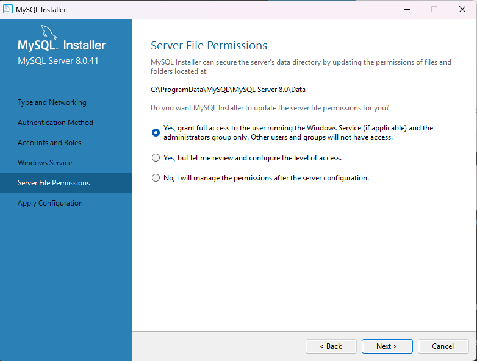

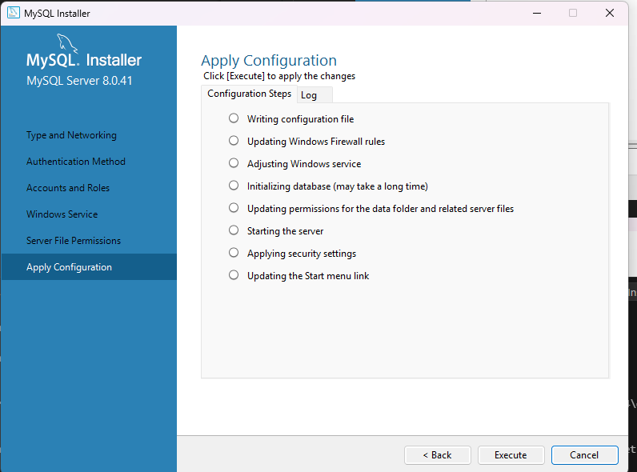

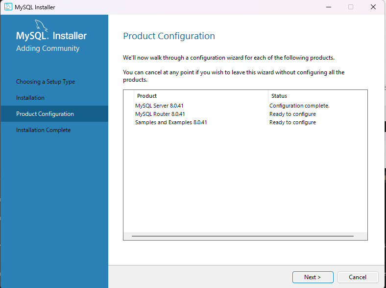

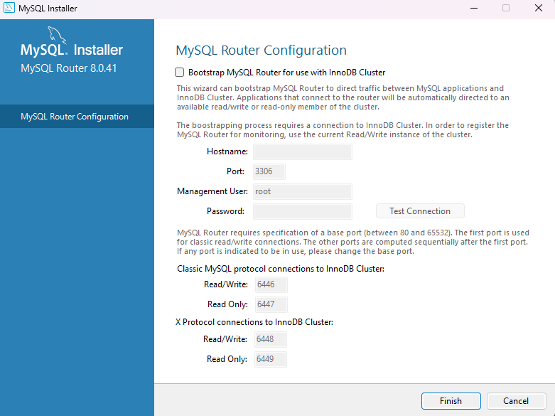

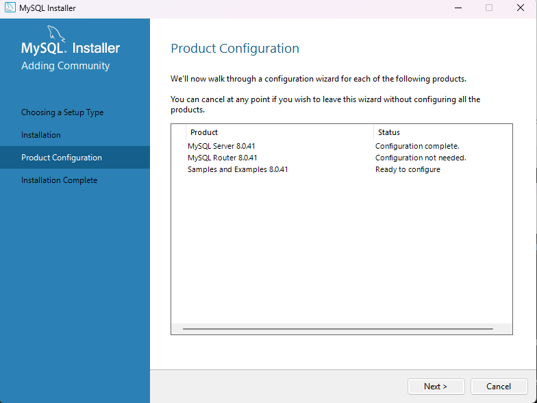

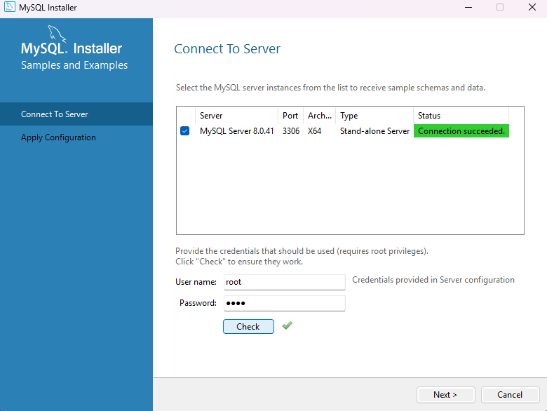

klik na `execute`

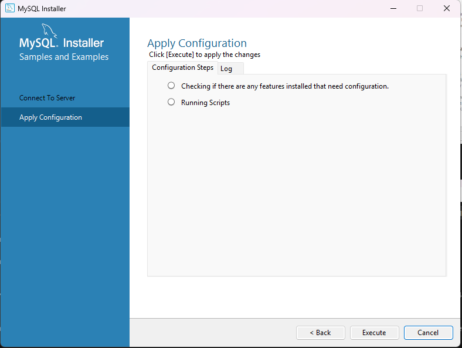

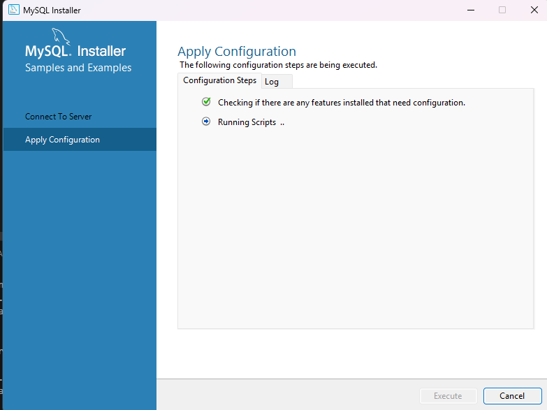

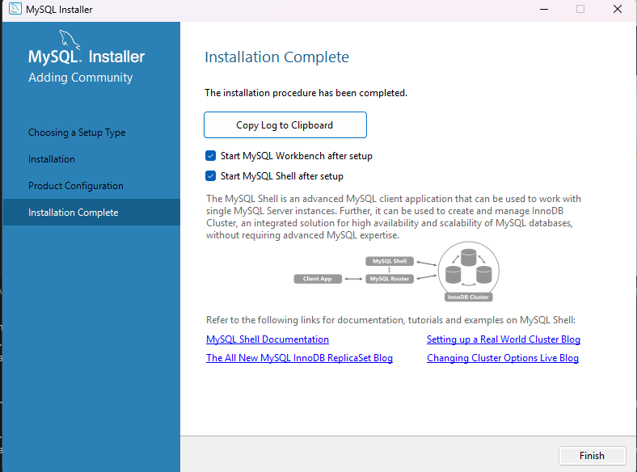

I pokrenute svoj projekat klikom na https u gornjem dijelu
